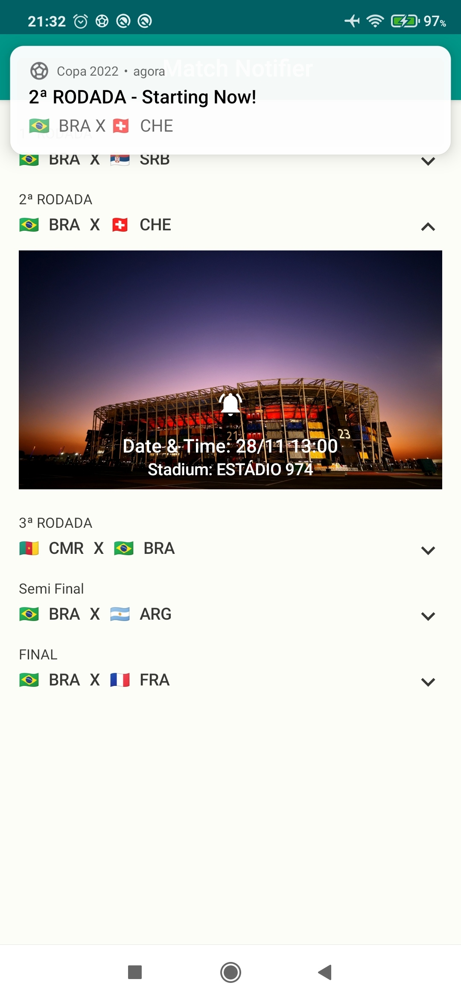
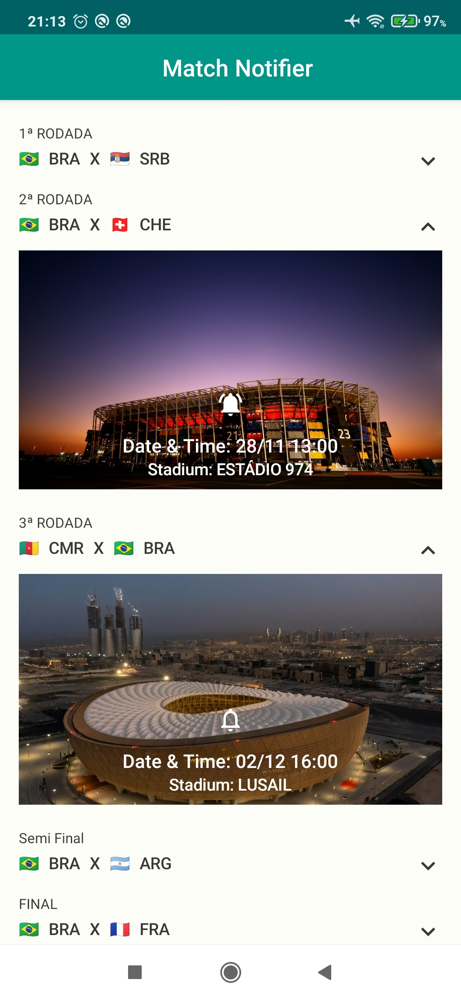

Match Notifier App
==================

This project is the final solution for the "Formação Android Developer" Course, provided
by [Digital Innovation One](https://www.dio.me) - An Information Technology teaching platform.

App Overview
------------

The project uses retrofit to make an asynchronous request and, if successful, render a list
of the World Cup Matches, along with their specific information. From this point, we can:

- Expand any item of the list to view its details
- Set a notification for the event
- Cancel a notification previously set
- Receive a notification for a specific match

You can check out [the original repository](https://github.com/digitalinnovationone/copa-2022-android/tree/feature/base-project) for further reference.

Technologies and Libraries used:
--------------------------------

- Jetpack Compose
- Dagger-Hilt for Dependency Injection
- ViewModel
- State Hoisting
- Data Store
- Animations API: (Visibility and State)
- Kotlin Flows
- Retrofit
- OkHttp
- GitHub Pages (For the API)

Screenshots:
------------

 

Getting Started
---------------

1. Download and run the app.

License
-------

Licensed to the Apache Software Foundation (ASF) under one or more contributor
license agreements.  See the NOTICE file distributed with this work for
additional information regarding copyright ownership.  The ASF licenses this
file to you under the Apache License, Version 2.0 (the "License"); you may not
use this file except in compliance with the License.  You may obtain a copy of
the License at

http://www.apache.org/licenses/LICENSE-2.0

Unless required by applicable law or agreed to in writing, software
distributed under the License is distributed on an "AS IS" BASIS, WITHOUT
WARRANTIES OR CONDITIONS OF ANY KIND, either express or implied.  See the
License for the specific language governing permissions and limitations under
the License.
